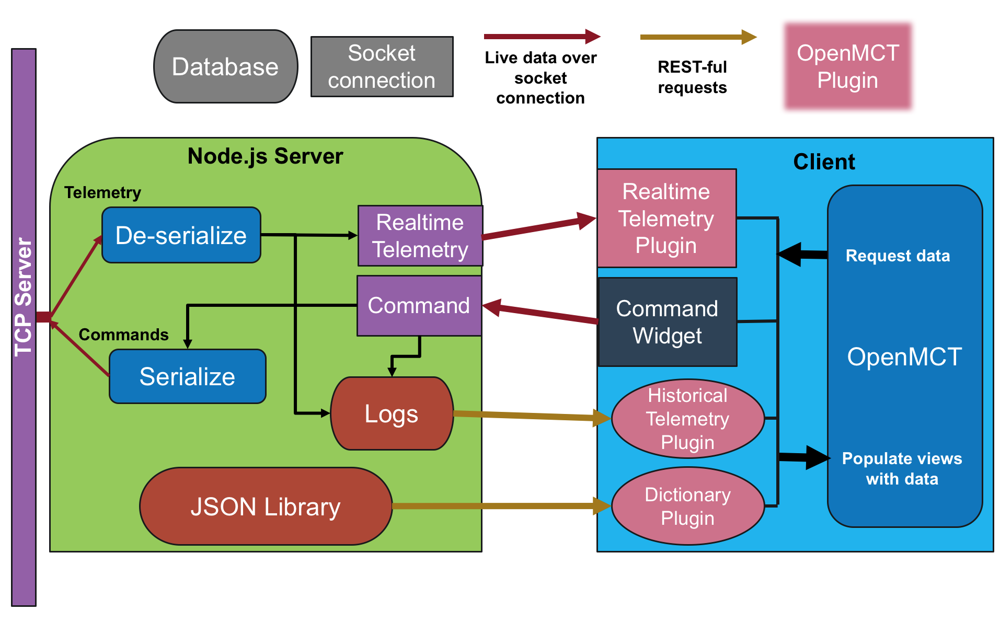

# Client - OpenMCT
 
## 1. Introduction
User Guide is [here](#User Guide)!

The `client-openmct` module is used to interface with targets using a [Node.js](https://nodejs.org) server and [Open Source Mission Control Software](https://nasa.github.io/openmct/) developed by AMES Research center. A computer sets up an instance of the Node.js server while the usual TCP server and targets are running. Clients connect to the server through their web browser, preferebly [Google Chrome](https://www.google.com/chrome/)

![OpenMCT Client] (res/img/PlotSS1.png)

## 3. Design

### 3.2 Protocols
The Node.js server serializes commands from the client to the TCP server and deserializes channel and event telemetry from a binary buffer to a datum object that OpenMCT can read.

#### 3.2.1 Channel Telemetry

| Packet Component | Description | Type, Size (In bytes) |
| :--------------: | :---------- | :--: |
| Size | Size of packet starting at end of this buffer | U32 |
| Packet Descriptor | '1' Signifying channel telemetry | U32 |
| Channel ID | Identify channel and use as key in dictionary.json | U32 |
| Time Base | <!--??--> | U16 |
| Time Context | <!--??--> | U8 |
| Seconds | Epoch time in seconds when datum was sent from target | U32 |
| Microseconds | Epoch microseconds when datum was sent from target | U32 |
| Channel Value | Value of datum. Use dictionary.json to parse into string, enum, or number. | (Size - 19) |

#### 3.2.2 Event Telemetry

| Packet Component | Description | Type, Size (In bytes) |
| :--------------: | :---------- | :--: |
| Size | Size of packet starting at end of this buffer | U32 |
| Packet Descriptor | '2' Signifying event | U32 |
| Log ID | Identify event and use as key in dictionary.json. | U32 |
| Time Base | <!--??--> | U16 |
| Time Context | <!--??--> | U8 |
| Seconds | Epoch time in seconds when datum was sent from target | U32 |
| Microseconds | Epoch microseconds when datum was sent from target | U32 |
| Event args | Args to create event string. Use dictionary.json to parse into string, enum, or number. | (Size - 19) |

#### 3.2.3 Commands 

| Packet Component | Description | Type, Size (In bits) |
| :--------------: | :---------- | :--: |
| Header | 'A5A5 FSW ZZZZ' | String, (13 * 8) |
| Size | Size of packet starting at end of this buffer | U32 |
| Packet Descriptor | '0' Signifying command | U32 |
| Opcode | Identify event and use as key in dictionary.json. | U32 |
| Command args | Arguments for command. Types and formats are found in dictionary | (Size - 19) |
 


### 3.3 Context



Incoming telemetry is handled by the [telemetry-server.js](../server/src/telemetry-server.js) module. Inside, a netsocket gains data from the TCP server. First the datum is parsed through a [deserialize.js](../server/src/deserialize.js) module. The parsed datums are sent to the client through a realtime telemetry websocket in telemetry-server.js. These datums are also saved in a log file under ./server/logs/telem-log.js. An OpenMCT plugin, [historical-telem-plugin.js](../client/js/plugins/historical-telem-plugin.js), sends http requests to the server for OpenMCT to server historical telemetry data in its views.

| Component | Function |
| :-------: | :------- |
|[telemetry-server.js](../server/src/telemetry-server.js)| Handles incoming telemetry. A netsocket recieves data from the TCP server | 
|[deserialize.js](../server/src/deserialize.js)| Parses data in buffer array into OpenMCT readable javascript object format. |
|./server/logs/telem-log.js| Saves parsed datums for historical telemetry views in OpenMCT. Directory and files created during start of Node.js server. |
|[historical-telem-plugin.js](../client/js/plugins/historical-telem-plugin.js)| Sends http requests to the server for OpenMCT to server historical telemetry data in its views. All http requests from client use [http.js](../client/js/http.js)|
|./server/src/res/dictionary.json | USed to store attributes for all channels, events, and commands. The backbone of argument parsing for all types of telemetry. Created on `npm start` using [json_dict.py](../bin/json_dict.py). |
|[dictionary-plugin.js](../client/js/plugins/dictionary-plugin.js)| Uses http requests to define the object structure of all channels and views in OpenMCT. | 
|[command-console.js](../client/js/plugins/command-console.js) | Uses [Vue.js](Vuejs.org) webwrapper to send commands over a socket server. |
|[command-server.js](../server/src/command-server.js)| Handles incoming commands from client using a listener. The commands are serialized into binary buffers and are sent to the TCP server.|
|[serialize.js](../server/src/serialize.js)| Uses the dictionary.json file to turn the command object into a binary buffer for the TCP server. |
|[index.html](../index.html)| The html file of the [SPA](https://en.wikipedia.org/wiki/Single-page_application) that Node.js serves to the user. OpenMCT is imported referenced in this file and is also configured. Also, the fragment of html used for the command widget is written since no web loader, such as [require.js](http://requirejs.org/) is used. |


## <a name="User Guide"></a>4. User Guide

```
npm install
npm start
```