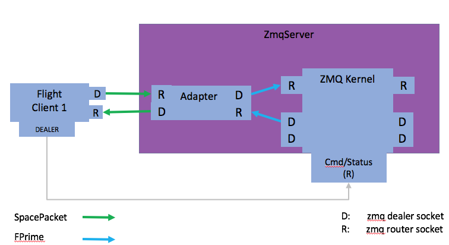
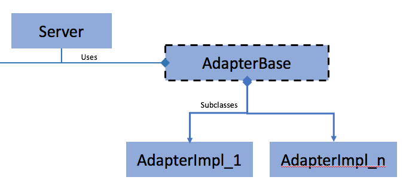
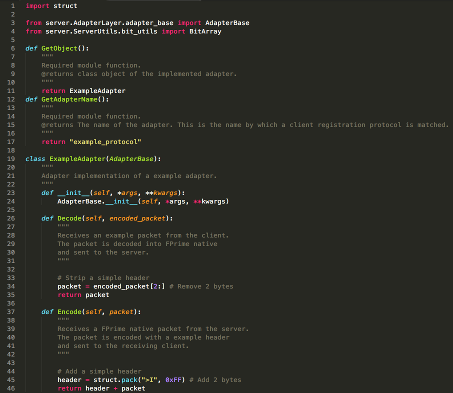
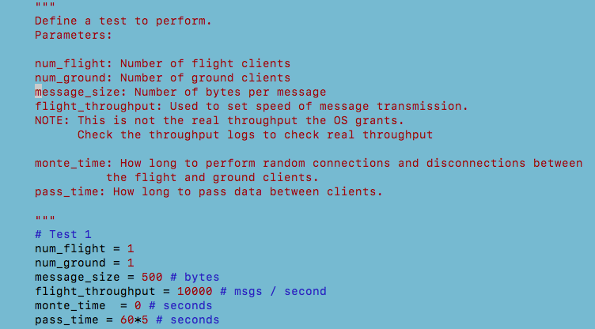
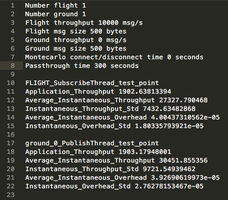
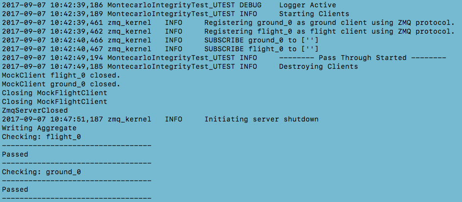

# FPrime GSE ZmqServer
####Contact:<br>
David Kooi<br>
kooi.david.w@gmail.com<br>
dkooi@ucsc.edu

## 1. Introduction

The GSE ZmqServer is a redesign of the legacy ThreadedTCPServer. 
The ZmqServer reqires flight and ground clients to use the Zmq library.
A C++ zmq-radio component is available for use on embdedded systems.

ZeroMq is a cross platform, high-performance, asynchronous, distributed messaging library.
<a href="http://zeromq.org/">http://zeromq.org</a>

The ZmqServer offers the following features:

- Runtime customizable many-many communication implemented using Pub/Sub architecture
- Pluggable protocol translators

This document first covers server the server commands that enable client registration, Pub/Sub configuration,
and server introspection. Then implementation details are discussed. 


## 2. Use

#####Required environment variables
```
export BUILD_ROOT = ...
export PYTHONPATH = $(BUILD_ROOT)/Gse/src 
```

The server is controlled and monitored through it's `Command Port`. The `Command Port` is the
common connection point for all flight and ground clients. Clients use this port for registration, server configuration, and
server introspection. 

#####Starting the server
```
python run_zmq_server.py <port_address> [options]
```
Options:<br>
- t : Enable thread latency logging<br>
- v : Enable verbose logging


### ZmqServer Constants

Server constants are defined in `server/ServerUtils/server_config.py`
These constants are used to compose server commands.

 


### ZmqServer Commands

Commands are delimited as Zmq Frames. All commands are sent as zmq multipart messages. Examples on sending commands are shown below the tables.
Wrapper to these commands are available in the GSE Api.


Command | Description | Usage | Server Response
------- | ----------- | ----- | ---------------
ServerConfig.REG_CMD | Register client to the server. Server allocates a publish, subscribe sockets for the client and return the port numbers in the response. | ['REG' `client_type` `protocol`] | [`status` `server_pub_port` `server_sub_port`]
ServerConfig.SUB_CMD | Subscribe a client to one or more other clients | ['SUB' `client_name` `client_type` `pub_client_1`...`pub_client_n` ] | [`status`]
ServerConfig.USUB_CMD | Unsubscribe a client from one or more other clients | ['USUB' `client_name` `client_type` `pub_client_1`...`pub_client_n`] | [`status`]
ServerConfig.LIST_CMD | Request a list of Flight and Ground client publishers | ['LIST'] | [`pickled_client_sub_dict`]

#### Arguments

Arg | Description | Value
--- | ----------- | -----
`client_type` | Flight or ground client | `ServerConfig.FLIGHT_TYPE` or `ServerConfig.GROUND_TYPE`
`protocol` | Any implemented protocol translator class residing in server.AdapterLayer.plugins | The name of the protocol
`pub_client` | The name of a publishing client
`pickeled_client_sub_dict` | A pickled dictionary contaning subscription information about all Flight and Ground clients

The default protocol is ZMQ. When using this protocol ZeroMQ acts as a transport layer for the packet. The server is agnostic to packet content. 

#### Registration example

A client must set their all Zmq socket identities to their `client_name` The server uses this socket identity to register the client and to route client messages.

**The server packs the response ports as little endian integers.**
This allows the zmq-radio component to more easily copy the zmq message contents into the memory.

##### Python Registration
This example shows gse.py registering to the ZmqServer.

 
`Gse/src/controllers/client_sock.py Line 143`

Interactive Example

```python
# Assume server is running on port 5555
import zmq
context = zmq.Context()
cmd_socket = context.Socket(zmq.DEALER)
cmd_socket.connect("tcp://localhost:5555")
cmd_socket.send_multipart([b'REG', b'GROUND', b'ZMQ'])
response = cmd_socket.recv_multipart()
pub_port = struct.unpack("<I", response[1])[0]
sub_port = struct.unpack("<I", response[2])[0]
```

##### C++ Registration
This example shows an embedded system registering to the ZmqServer.


`fprime-zmq/zmq-radio/ZmqRadioComponentImpl.cpp Line 176`

#### Subscription example
##### Python subscription

This example shows the functions used by gse api to subscribing or unsubscribing clients.

 
`Gse/src/controllers/zmq_server_command.py Line 21`


Interactive Example

```
# Assume server is running on port 5555
import zmq
context = zmq.Context()
cmd_socket = context.Socket(zmq.DEALER)
cmd_socket.connect("tcp://localhost:5555")
cmd_socket.send_multipart([b'SUB', b'gui_1', b'GROUND', b'flight_1'])
```

#### List example
##### Python list
This example shows a server request for Pub/Sub information. The returned dictionary is publisher based. I.e each publisher maintains a set of clients who are subscribed to it. The format of the dictionary is defined in the `Routing Table` heading
of the `Implementation` section.

 
`Gse/src/controllers/zmq_server_command.py Line 39`  


## 3. Implementation

### Server Design
The server is composed of two main parts:

- ZmqKernel
- Protocol Adapters

 

### ZmqKernel
 

The server uses two static sockets for receiving messages and a variable number of sockets
for publishing messages. There is one publish thread per client.

There were several desires that guided the choice in server architecture. They were:

- Simple clients: Clients should send and receive without knowledge of who they sending to and receiving from.
- Simple routing: Avoid explicit routing as ZMQ already performs that function efficiently.
- Minimize threading and interconnections.

Simple clients are achieved by performing routing within the ZmqServer. A client's only responsibility is to send
packets with their identification prepended to the message. Identity prefixing is done by ZMQ sockets automatically. If a socket is not given an identity, ZMQ creates a random identity.

Simple routing is achieved by having one subscriber thread for all incoming packets. This allows the packets to be routed internally through the use of ZMQ Pub/Sub sockets. Zmq Pub/Sub sockets perform routing by prefix matching. Since all client's have their identity prepended to the message, messages may be forwarded from the incoming ROUTER socket to the internal PUB socket without modification. SUB sockets are connected to their complimentary PUB socket. The SUB sockets are configured by the main event loop. The PUB socket sends out identity prefixed packets and the SUB sockets automatically filter indentities they are not subscribed to. 

A routing table is used to maintain the current Pub/Sub state. This table is only for user inspection because, as explained,
all routing is done by Zmq Pub/Sub sockets. The Zmq Pub/Sub sockets are configured through a `routing command socket`.
This socket sends messages to publisher threads regarding who they are subscribed to. 

This architecture minimizes the number of threads and interconnections used by using ZMQ's Pub/Sub routing and using 
only the number of threads that are nessecary. 

Functionally, one publisher thread per client is nessecary because message routing is done by prefix matching. Each publisher thread is 'subscribed' to any number of prefixes. The prefixes represent the publisher's identity.


#### Main Event Loop Reactor
------------------
The main event loop reactor handles incoming server command messages. When a command is received, the appropriate
command handler is dispatched.

##### Registration Commands

Each client that registers creates a new client specific publish thread. The server first checks if the client is already registered. If the client exists there is no need to recreate a publish thread. If the client does not exist, outbound TCP port numbers are created, the client is added to the routing table, and a new publisher thread is created with the newly generated port number. 

The server then checks what protocol the client is using. If the protocol is not ZMQ and adapter class is loaded from the 
`server/AdapterLayer/plugins` directory.  

#####  Subscription and Unsubscription commands

The routing table is updated when a subscription on unsubscription command is received. 
An internal command is sent to all publisher threads. The threads which the subscription
or unsubscription command effect have their Zmq socket options changed. 

##### List commands

A list command serialzes the routing table dictionary and returns it to the requesting client.
The serialization format is a python pickle.

#### Routing Table
----------------

Entries are stored in the publisher's perspetive. 
I.e all publishers keep a set of who is subscribed to them. The routing table take the following format:

```python
# Example routing table:
# flight_client_1 publishes to ground_client_1
# flight_client_2 publishes to ground_client_2
# Neither ground clients are set to publish

routing_table = 
{
ServerConfig.FLIGHT_TYPE:{
		flight_client_1: set('ground_client_1'),
 		flight_client_2: set('ground_client_2')
 	}
ServerConfig.GROUND_TYPE:{
 		ground_client_1: set(),
 		ground_client_2: set()
 	}
}
``` 

#### Subscriber Threads
----------------------
Subscriber threads recieve all packets from their type of clients. Packets are received by a zmq ROUTER socket and
passed to a zmq PUB socket without modification. The identity created by the client 
is all that is needed for the packet to be 'routable'.

#### Publisher Threads
----------------------
Publisher threads are unique for each client. Publisher threads receive packets from a zmq SUB socket and send packets to their client via a zmq DEALER socket. Publisher threads also keep a routing command socket. This socket is used to receive commands from the main event loop.

#### Adapters
-------------
Adapers **decode** an arbitrary protocol into FPrime native and **encode** FPrime native into an arbitrary protocol.

When a client registers it is required to send tell the server which protocol to use. 
The default protocol is ZMQ. This tells the server to act as a end to end transport for what ever packets are coming through.

If a different protocol is requested an Adapter is created and placed between the client and the server.
<br>


<br>

##### Adapter Implementation
Adapters are implemented by creating a AdapterBase subclass inside of server/AdapterLayer/plugins. The Adapter is automatically loaded into the application. Implementation modules must have the following module level functions:

The virtual methods of the AdapterBase are shown below.

<br>
`Gse/src/server/AdapterLayer/plugins/adapter_example.py`


#### Command Line Utility
-------------------------
A command line utility is available to configure the Pub/Sub configuration of the server.

Command line use:

```
cd Gse/bin
python run_zmq_server_config.py 5555 localhost
```

#### ZmqServer Tests
--------------
A throughput and integrity test are located in: `Gse/src/server/tests`<br>

The test is configured by editing `run_integrity_test.py`:<br>

`Gse/src/server/tests/run_integrity_test.py`


These parameters allow you to test different configurations using the server. The test creates 
n flight clients and n ground clients. Flight clients publish data to all ground clients. The data
is padded to conform to the requested size.

Command line use:

```
cd Gse/src/server/tests
vi run_integrity_test.py and edit test configuration parameters.
python run_integrity_test.py
examine results in server/logs/throughput/aggregate.txt
```


The test can be used for:

- Throughput analysis
- Data integrity
- Server integrity

##### Throughput analysis: Records latency and throughput of each thread
The server test uses the `Gse/utils/throughput_analyzer.py` utility.<br>
The `throughput_analyzer` module allows the user to create `TestPoints` within a thread. The `TestPoint` can be used to record:

- Total throughput (total messages / total time )
- Instantenous latency: Time for thread receive and send a message
- Instantenous throughput: ( 1 / instantenous latency )

Usage example:

```python
# Server Subscriber thread
...
    
test_point = throughput_analyzer.GetTestPoint(self.__name + "_test_point") # Create test point
test_point.StartAverage() # Start timing the total lifetime

try:
    while(True):
        socks = dict(poller.poll()) # Block until msg is received
        if(self.__sub_socket in socks):

            test_point.StartInstance() # Start instance timer

            msg = self.__sub_socket.recv_multipart(copy=False) 
            self.__pub_socket.send_multipart(msg, copy=False)  
                                                               
            test_point.SaveInstance() # Stop instance timer
            test_point.Increment(1)   # Increment the total number of msgs sent

...

# Exit
test_point.SetAverageThroughput() # Stop timing the total lifetime
test_point.PrintReports()         # Print reports to file
```

`Gse/src/server/Kernel/thread.py`

Test points are aggregated at the end of the test. Their results can be seen in:
`server/logs/throughput/aggregate.txt`

<br>

##### Data integrity: Checks if packets were dropped during the test
Flight clients publish a ramp function to all ground clients.
The ramp function increases by 1 to 255 in steps of 1. 

Ground clients receive and log the received values. After the passthrough is finished
the logs are checked for inconsistencies. 

<br>


#####Server integrity: Checks if the server can withstand arbitrary connections and disconnections
If the test parameter monte\_time is greater than 0, the test will perform random connections
and disconnections for monte\_time seconds. 


#### Future Work
----------------
- Error messages when server drops packets 
- GSE API Client Demo
- Further throughput testing with outbound clients
- Add command to list all registered protocol translations
- gse.py auto connect