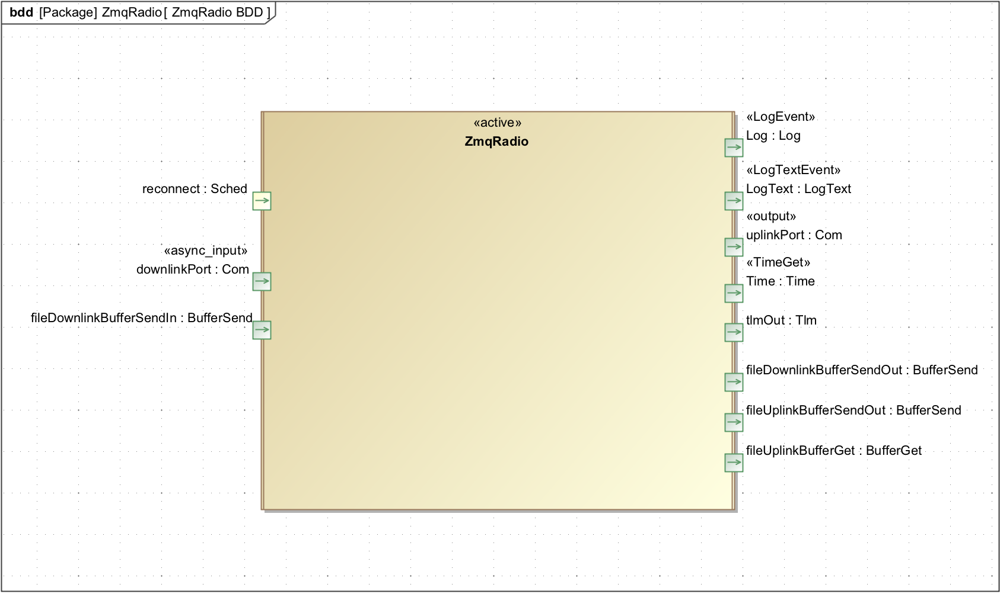

# ZmqRadio Component

## 1. Introduction

The ZmqRadio is an active component that provides an interface to the 
ZeroMQ based GSE server. 

The FPrime ZeroMQ GSE server uses ZeroMQ as a socket middleware library. An interface is needed to allow an embedded system to communicate with the server. This component provides that.  

The component takes input from a `Fw::Com` and `Fw:BufferSend` port.
These inputs are serviced by the `Zmq::ZmqRadio::downlinkPort_handler` and 
`Zmq::ZmqRadio::filedownlinkbuffersendin_handler`, respectively. 

An `Os::Task` listener thread, `Zmq::ZmqRadio::subscriptionTask`, runs in parallel with the ZmqRadio's main thread. This listener thread blocks and listens for packets coming from the ground system.

The component uses state to determine it's behavior. There are two states the component can be in:

- `ZMQ_RADIO_CONNECTED`
- `ZMQ_RADIO_DISCONNECTED`

The ZmqRadio's state controls each input handlers to keep message queues 
from backing up. The internal state also facilitates persistent reconnection
attempts. 

A ZMQ error, such as a network disconnect, may change 
`ZMQ_RADIO_DISCONNECTED` state. While in a disconnected state the component tries to reconnect with the server. The state is restored to `ZMQ_RADIO_CONNECTED` if connection is successful.


## 2. Requirements
Requirement | Description | Verification Method
----------- | ----------- | -------------------
1 | All input handlers shall drop incoming messages while in `ZMQ_RADIO_DISCONNECTED`. | 
2 | The 'Zmq::ZmqRadio::subscriptionTask' shall be idle while in `ZMQ_RADIO_DISCONNECTED`. |
3 | All ZMQ resources shall be released upon transitioning from `ZMQ_RADIO_CONNECTED` to `ZMQ_RADIO_DISCONNECTED`. | 
4 | `Zmq::ZmqRadio::State::transitionDisconnected` shall be called if, apart from EAGAIN, a ZMQ error is experienced anywhere. |
5 | `Zmq::ZmqRadio::State::transitionDisconnected` shall be called after `ZMQ_RADIO_SNDHWM` number of failed socket sends.
6 | `Zmq::ZmqRadio::State::transitionConnected` shall be called if `Zmq::ZmqRadio` successfully registers to the server. | 
7 | ZMQ library shall be configured with the options below. |
8 | The `Zmq::ZmqRadio` component shall be configured with the options below. |

ZMQ Option | Description |  Value 
---------- | ----------- | --------------
`ZMQ_LINGER` | How long to keep socket alive after a socket close call. | 0 seconds
`ZMQ_RCVTIMEO` | How long before a `zmq_msg_recv` call returns an EAGAIN error. | 200 ms 
`ZMQ_SNDTIMEO` | How long before a `zmq_msg_send` call returns an EAGAIN error. | 200 ms


`Zmq::ZmqRadio` Option | Description |  Value 
---------- | ----------- | --------------
`ZMQ_RADIO_NUM_RECV_TRIES` | Number of times the component retries receiving an uplinked packet. | 5 s
`ZMQ_RADIO_SNDHWM` | Maximum number of outbound packets queued until transition to `ZMQ_RADIO_DISCONNECTED` | 5 msgs

## 3. Design

### 3.1 Context

#### 3.1.1 Component Diagram

 

#### 3.1.2 State Diagram

 

#### 3.1.3 Sequence Diagram
 


## 4. Functional Description

### 4.1 downlinkPort_handler 
If `ZMQ_RADIO_CONNECTED`:     This handler invokes the helper function 'zmqSocketWriteComBuffer'.<br>
If `ZMQ_RADIO_DISCONNECTED`:  No action.

### 4.2 filedownlinkbuffersendin_handler 
If `ZMQ_RADIO_CONNECTED`:     This handler invokes the helper function 'zmqSocketWriteFwBuffer'.<br>
If `ZMQ_RADIO_DISCONNECTED`:  No action.

### 4.3 groundSubscriptionListener 
If `ZMQ_RADIO_CONNECTED`:     This handler polls for uplinked packets and delivers the packets to their
                            destination component. <br> 
If `ZMQ_RADIO_DISCONNECTED`:  No action.

### 4.4 transitionConnected
If `ZMQ_RADIO_CONNECTED`:     No action. <br>                           
If `ZMQ_RADIO_DISCONNECTED`:  Set state to `ZMQ_RADIO_CONNECTED` 

### 4.5 transitionDisconnected
If `ZMQ_RADIO_CONNECTED`:     Set state to `ZMQ_RADIO_DISCONNECTED` and release ZMQ resources. <br> 
If `ZMQ_RADIO_DISCONNECTED`:  No action. 

### 4.6 sched_handler
Is connected to a 1Hz rategroup for persistent reconnection attempts.

If `ZMQ_RADIO_CONNECTED`:     No action. <br> 
If `ZMQ_RADIO_DISCONNECTED`:  Attempts connection and registration with the server.

Dictionaries: [HTML](ActiveLogger.html) [MD](ZmqRadio.md)


## Future Work
- Change receive and sending to use a Serializable instead of incrementing a buffer pointer
- Remove use of ntohl for network correction
- Remove strings from EVRs

##5.0 Running Unit Test Cases

The unit tests all need a running instance of the `run_zmq_server.py` server so before executing unit test cases in a seperate shell window execute this

````
python run_zmq_server.py 5555
````

Then do

````
make ut_clean ut run_ut
````
in the component directory.
